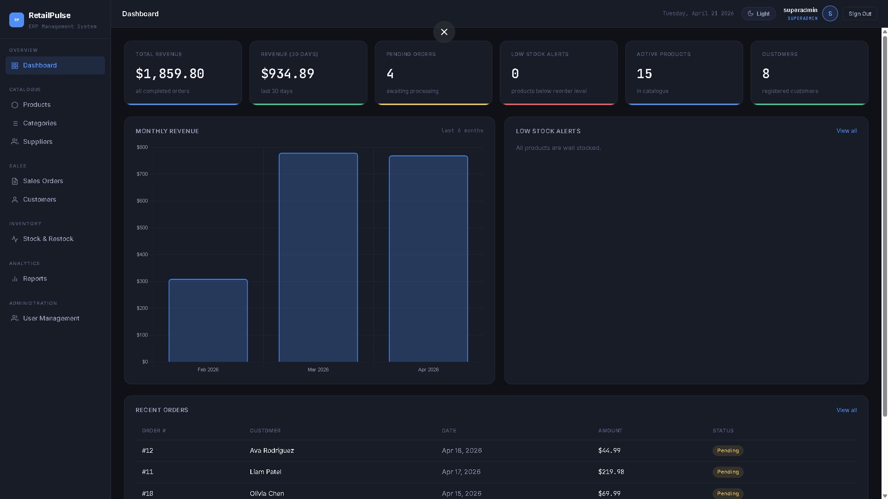
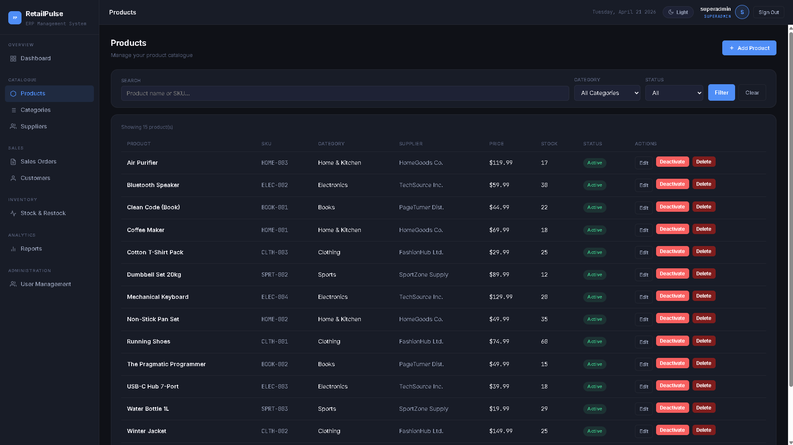
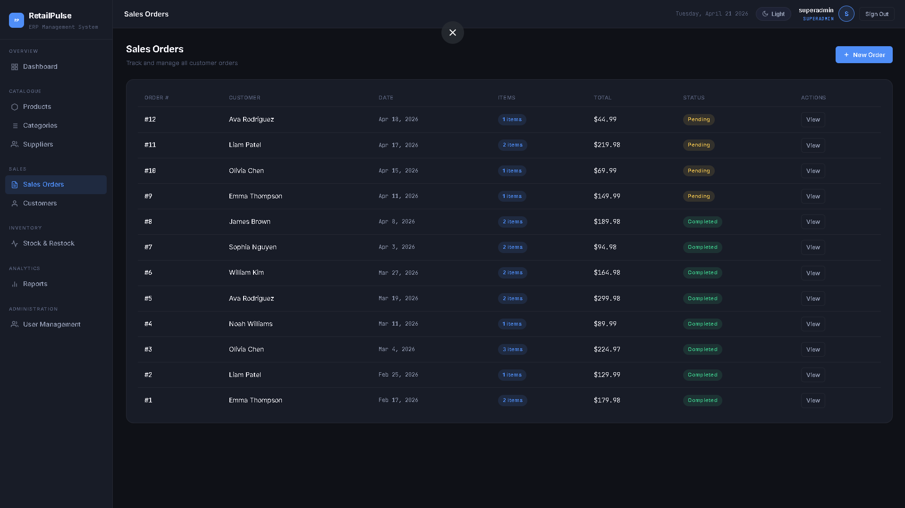
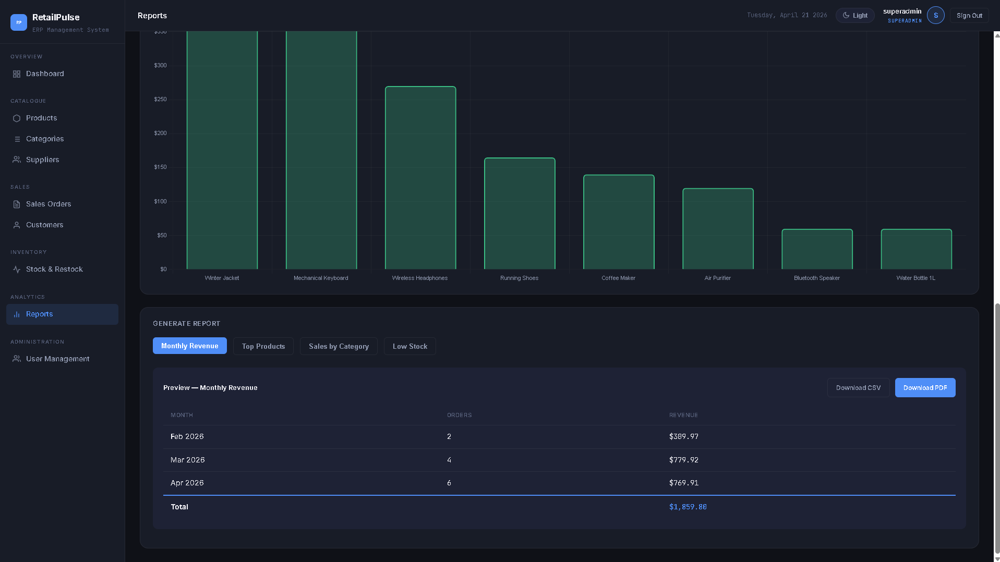
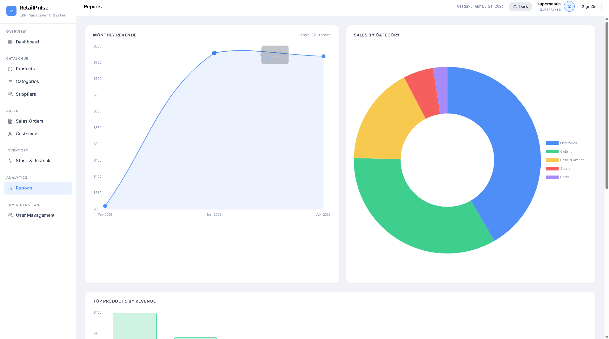
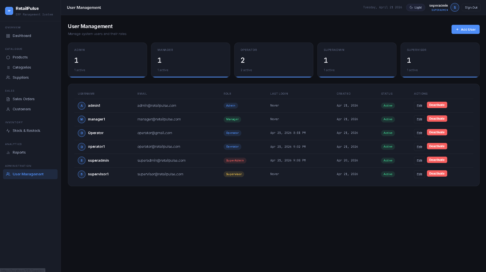
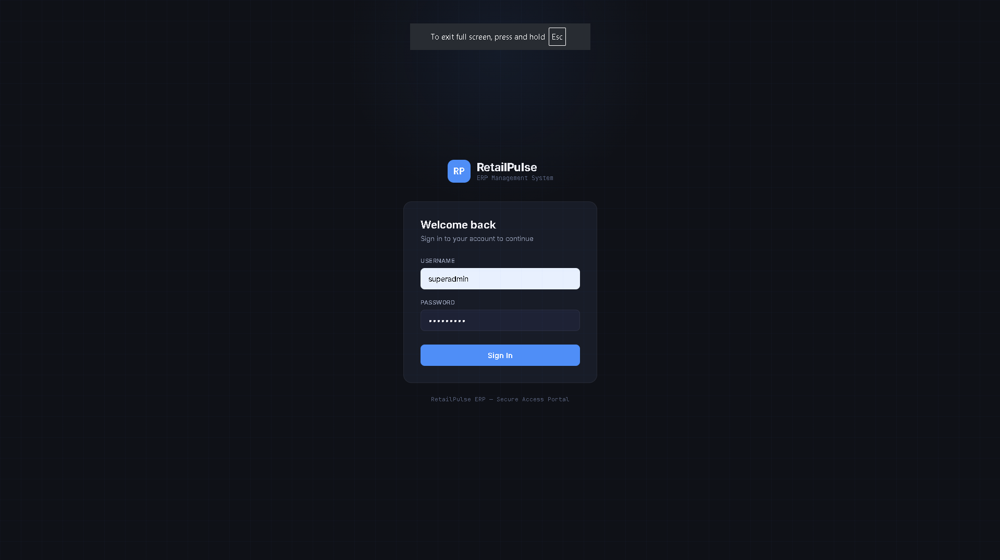

# RetailPulse

> Full-stack ERP-Lite system with inventory management, sales tracking, supplier management, analytics dashboard, and role-based access control.


---

## Overview

RetailPulse is a production-grade ERP-Lite web application built entirely in C# and ASP.NET Core 9 with SQL Server. It covers the full retail operations lifecycle — from product and supplier management through to sales orders, inventory restocking, analytics reporting, and secure role-based access control.

No Python, no external BI tools, no Docker. Everything — data access, business logic, PDF generation, analytics, and authentication — is handled server-side in .NET.

---

## Screenshots

### Dashboard


### Products


### Sales Orders


### Reports & Analytics (Dark Mode)


### Reports & Analytics (Light Mode)


### User Management


### Login


---

## Features

### Core Modules
- **Dashboard** — KPI cards (revenue, pending orders, low stock alerts, active products), monthly revenue bar chart, low stock panel, recent orders table
- **Products** — Full CRUD with category and supplier filtering, search, activate/deactivate, hard delete with order integrity check
- **Categories** — Add, edit, delete with product count display and deletion guard
- **Suppliers** — Supplier network management with contact info, product counts, and activate/deactivate
- **Customers** — Customer profiles with order history, total spend, and detail view
- **Sales Orders** — Order creation with live total calculator, line item management, status tracking (Pending / Completed / Cancelled)
- **Inventory** — Stock level monitoring with color-coded alerts, restock form with live preview, full restock history log
- **Reports** — Monthly revenue line chart, sales by category doughnut chart, top products bar chart, report preview table, CSV and PDF export powered by QuestPDF

### Authentication & Security
- Custom branded login page — no browser defaults
- JWT-based authentication stored in HTTP-only cookies
- BCrypt password hashing — no plain text passwords
- Role-Based Access Control (RBAC) with 5 roles:

| Role | View | Add | Edit | Deactivate | Hard Delete | Reports | User Management |
|---|---|---|---|---|---|---|---|
| Super Admin | Yes | Yes | Yes | Yes | Yes | Yes | Yes |
| Admin | Yes | Yes | Yes | Yes | Yes | Yes | No |
| Manager | Yes | Yes | Yes | Yes | No | Yes | No |
| Supervisor | Yes | Yes | Yes | No | No | Yes | No |
| Operator | Yes | No | No | No | No | Yes | No |

- Permissions stored in SQL Server — fully dynamic, not hardcoded
- Server-side permission enforcement on every write action
- UI elements hidden based on role — buttons removed from view, not just disabled
- Custom confirmation modal dialogs — no browser `confirm()` calls
- Custom 404 and error pages

### UI / UX
- Dark / Light mode toggle with localStorage persistence
- Animated KPI counter cards
- Staggered table row fade-in animations
- Chart.js animated charts with custom tooltips
- Fully custom CSS design system — no Bootstrap
- Professional sidebar navigation with active state indicators
- shields.io badges, SVG favicon, RP logo icon

---

## Tech Stack

| Layer | Technology |
|---|---|
| Framework | ASP.NET Core 9 MVC |
| Language | C# 11 |
| ORM | Entity Framework Core 9 |
| Database | SQL Server (LocalDB) |
| Authentication | JWT + Cookie Auth + BCrypt.Net |
| PDF Generation | QuestPDF 2024 |
| Charts | Chart.js 4.4 |
| Fonts | Inter + JetBrains Mono (Google Fonts) |

---

## Project Structure

```
RetailPulse/
├── RetailPulse.Web/
│   ├── Controllers/          # MVC Controllers
│   ├── Data/                 # AppDbContext + EF Core config
│   ├── Models/               # Entity models + ViewModels
│   ├── Services/             # JwtService, AuthService, PermissionService, DbSeeder
│   ├── Views/                # Razor Views (.cshtml)
│   └── wwwroot/              # CSS, JS, favicon, screenshots
└── RetailPulse.Database/
    ├── schema.sql            # Full database schema
    ├── seed.sql              # Sample data
    └── auth_schema.sql       # Roles, permissions, users schema
```

---

## Database Design

The schema follows a normalized relational design with proper foreign key constraints, indexes, and views.

**Core tables:** Products, Categories, Suppliers, Customers, SalesOrders, SalesOrderItems, RestockLog

**Auth tables:** Users, Roles, Permissions, RolePermissions

**Views:** `vw_LowStockProducts`, `vw_MonthlyRevenue`

**Stored Procedure:** `sp_RecalculateOrderTotal`

---

## Getting Started

### Prerequisites

- .NET 9 SDK
- SQL Server Express or LocalDB
- SQL Server Management Studio (SSMS)
- Visual Studio 2022 or VS Code

### Setup

**1. Clone the repository:**
```bash
git clone https://github.com/DoshiTirth/RetailPulse.git
cd RetailPulse
```

**2. Create the database:**

Open SSMS, connect to `(localdb)\MSSQLLocalDB` and run these scripts in order:
```
RetailPulse.Database/schema.sql
RetailPulse.Database/seed.sql
RetailPulse.Database/auth_schema.sql
```

**3. Configure the connection string:**

The connection string in `RetailPulse.Web/appsettings.json` is pre-configured for LocalDB:
```json
"ConnectionStrings": {
  "DefaultConnection": "Server=(localdb)\\MSSQLLocalDB;Database=RetailPulseDB;Trusted_Connection=True;TrustServerCertificate=True;"
}
```

**4. Run the application:**
```bash
cd RetailPulse.Web
dotnet run
```

Or press **F5** in Visual Studio 2022.

**5. Login with the default Super Admin account:**

| Field | Value |
|---|---|
| Username | `superadmin` |
| Password | `Admin@123` |

> Change the default password after first login via User Management.

---

## Default Test Accounts

After running the auth schema, you can create additional users via the User Management page. Suggested test accounts:

| Username | Role | Access Level |
|---|---|---|
| superadmin | Super Admin | Full access + user management |
| admin1 | Admin | Full access |
| manager1 | Manager | Add, edit, deactivate |
| supervisor1 | Supervisor | Add and edit only |
| operator1 | Operator | View and reports only |

---

## Key Design Decisions

**Soft delete over hard delete** — Products and suppliers use activate/deactivate to preserve data integrity with historical orders. Hard delete is only available for products with no associated orders.

**No hardcoded permissions** — All role permissions are stored in the `RolePermissions` table in SQL Server. Adding a new permission requires only a database insert, no code changes.

**Server-side + client-side enforcement** — Every write action checks permissions both in the controller (server-side) and in the view (client-side button hiding). Security is never left to UI alone.

**Cookie-based JWT** — JWT tokens are stored in HTTP-only cookies, not localStorage, to prevent XSS attacks.

**Custom confirmation modals** — All destructive actions use a custom-built modal dialog matching the app's design system instead of browser `confirm()` dialogs.

---

## License

Copyright (c) 2026 Tirth Doshi. All rights reserved.

This project is not open source. No part of this codebase may be reproduced, distributed, or used without explicit written permission from the author.
